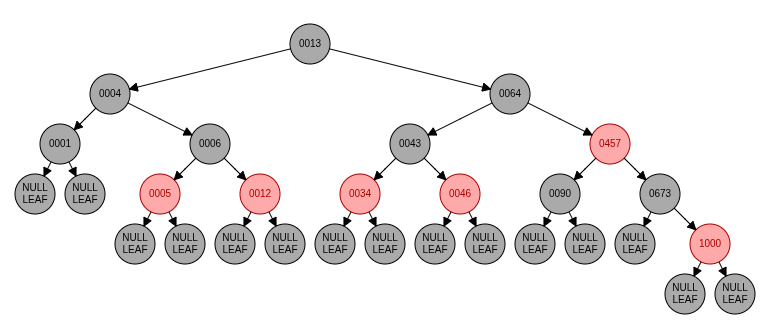
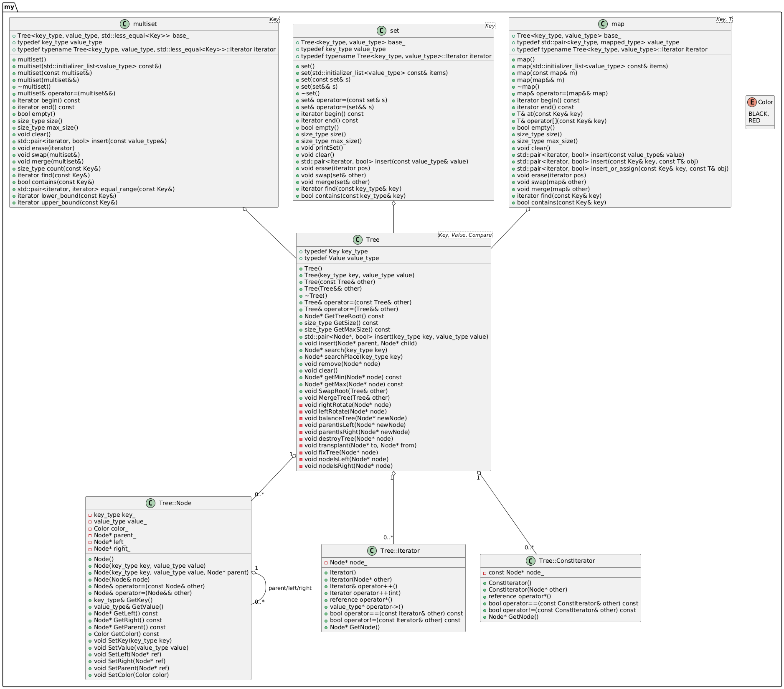
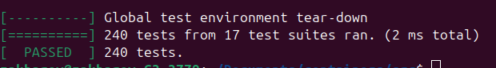
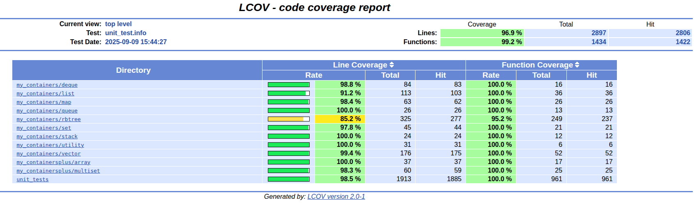

# Контейнеры

## Описание проекта

Групповой учебный проект, реализация основных контейнеров из стандартной библиотеки STL для С++.

Контейнеры делятся на последовательные, такие как vector, deque или list, где данные расположены последовательно, и ассоциативные, как map или set, где значение ассоциированы с некоторым ключом, по которому и происоходит доступ к элементу.

## Реализация

Мной были реализованы ассоциативные контейнеры map, set и multiset.

Основой этих контейнеров является Красно-черное бинарное дерево поиска (rbtree). Такая структура данных обеспечивает одинаковую асимптотическую сложность добавления или удаления элемента из любого места контейнера, так же позволяет произвести поиск за те же O(log n). Благодаря правилам обработки красно-черности дерево всегда сбалансированно.

Проект реализован в парадигме ООП, с использованием обобщенного программирования.

## Структура классов

## Тестирование

Код проекта покрыт тестами с помощью библиотеки GTest, общее покрытие составляет более 95%, проверить можно с помощью GCOV.

На утечки памяти код тестировался с помощью утилит fsanitaze для gcc и valgrind.

## Стиль

Проект написан на С++17 и разрабатывался в соответсвии с Google Style. Для проверки и форматирования кода использовалась утилита clang-format 18.1.8 и cppcheck.